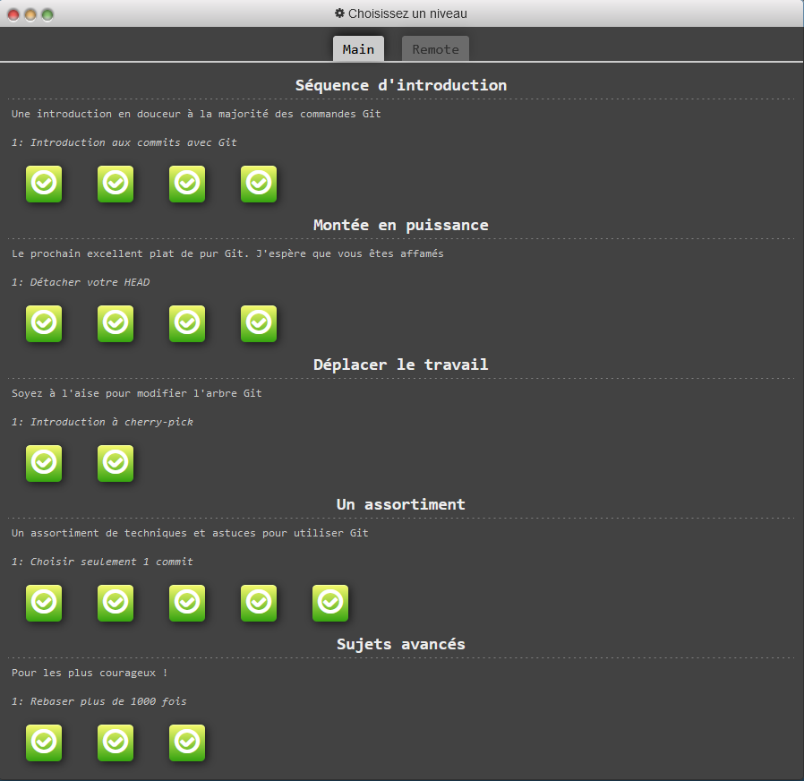

# TP1: Utilisation de git

## Commandes apprises:
#### **REBASE**
    J'ai pu comprendre comment effectuer un "git rebase"
    à l'inverse d'un merge, cette commande s'utilise depuis la branche possédant les commits à rebase.

#### **RESET**
    Avant j'utilisais reset uniquement pour annuler mes erreurs lors de l'utilisation de "git add". peut être que je réussirais un jour à ne plus avoir besoins de supprimer mes repositories une fois cassés :joy:

#### **REVERT** 
  

--------------------------

  

## Solutions des exercices:

#### **CHERRY-PICK**
- git cherry-pick C3 C4 C7

#### **REBASE-INTERRACTIF**
- git rebase -i HEAD~4
    
    (On Doit retirer C2 et déplacer C5 à la place de C4)

#### **SELECT-1-COMMIT**
- git rebase -i HEAD~4

    (On ne sélectionne que C4)
- git checkout main
- git cherry-pick C4

#### **SELECT-2**
- git rebase -i HEAD~2

    (on inverse C2 et C3)
- git commit --amend
- git rebase -i HEAD~2

    (on ré-inverse C2 et C3)
- git rebase caption main

#### **SELECT-3**
- git checkout main
- git cherry-pick C2
- git commit --amend
- git cherry-pick C3

  

--------------------------

  

## Exos effectués:
